# Ultra UI Skill

A practical workflow for steering generic, template-like AI interface output toward a distinctive, observable, and production-aware design direction.

## What it covers

- Explore directions that differ in structure, typography, color logic, material, and interaction—not just surface styling.
- Translate subjective taste into an observable brief with concrete decisions and explicit avoidances.
- Review screenshots or prototypes with an isolated visual critic that separates visible gaps from unverified risks.
- Bound revision loops with a maximum number of rounds, stop conditions, and explicit authorization for further iteration.
- Remove common AI tells, then check real content, states, accessibility, responsive behavior, performance, and polish.

The skill is framework-, model-, and vendor-agnostic. It guides design judgment; it does not replace user research, accessibility testing, or production validation.

## Visual case study

Mosaic follows one fictional product from design direction through product proof to a continuous interaction sequence.

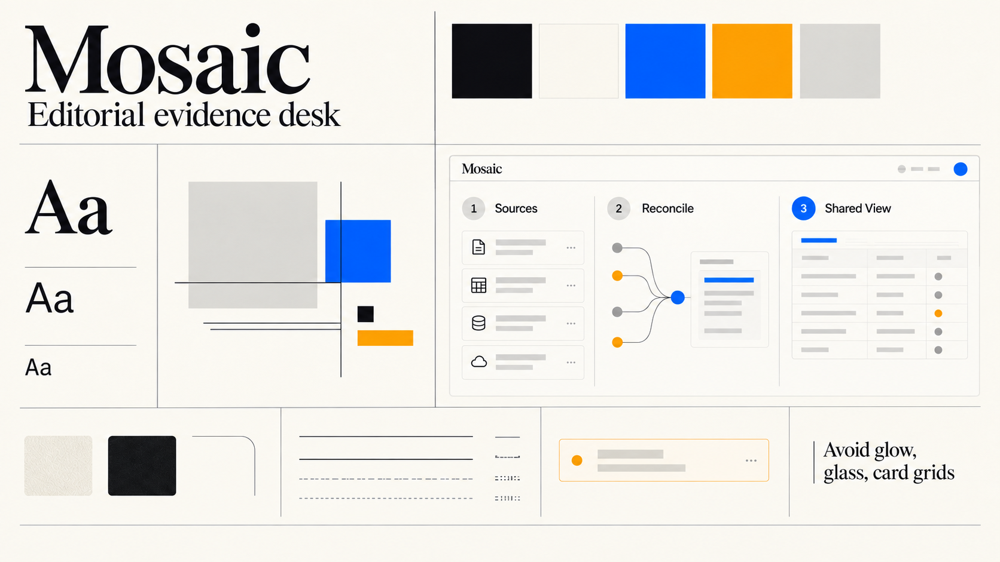

*Direction definition: the visual thesis, palette, typography, layout grammar, and explicit avoidances establish a shared design brief.*

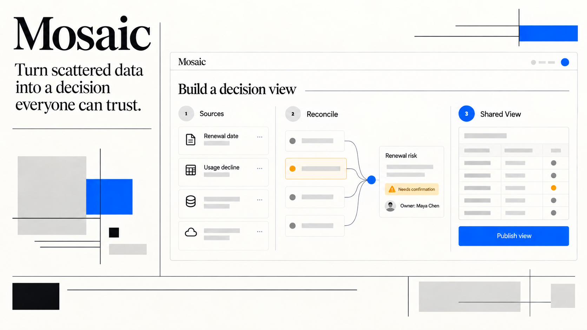

*Landing-page product proof: a concrete renewal-risk scenario demonstrates the product journey instead of relying on decorative UI.*

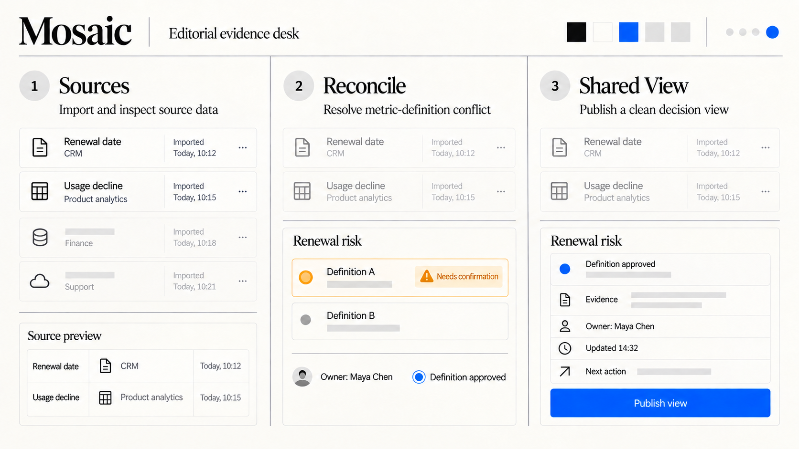

*Continuous interaction states: one product surface progresses from source inspection through conflict resolution to a published decision view.*

> Mosaic is a fictional product. These are generated concept renders illustrating the Ultra UI Skill workflow, not production screenshots or evidence of guaranteed output quality.

## The ten presets, rendered

Each board below applies one preset to the **same fixed skeleton** — wordmark and positioning line, colour palette, type-scale specimen, abstract brand geometry, a low-fidelity product wireframe, a material swatch, a corner/edge study, a component specimen, and a one-line guardrail. The skeleton is identical so the presets can be compared side by side; everything else is the preset's own material and depth language — corner radius, shadow, translucency, texture, density, divider treatment, and the ink-to-whitespace ratio.

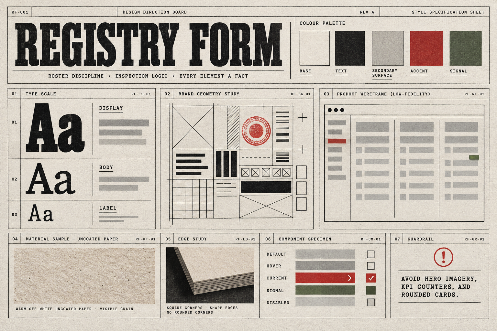

**P1 · On Roster 在册名册** — *Registry form.* Tabular discipline, numbered rows, seal-red accent on uncoated paper. Almost no motion; everything reads as a registrable fact.

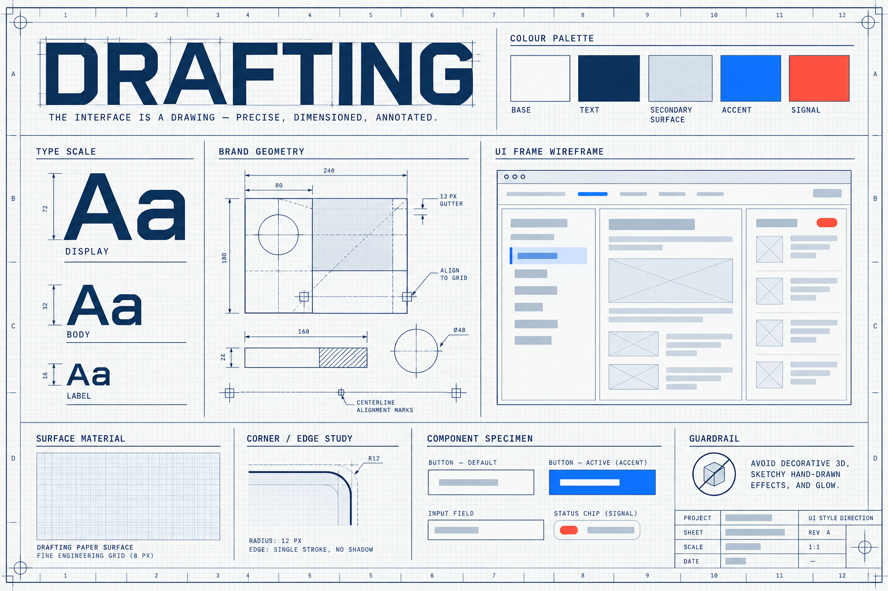

**P2 · Blueprint 工程图纸** — *Drafting drawing.* Engineering grid, drawing border, registration marks, dimension lines, title block. Precision is the aesthetic.

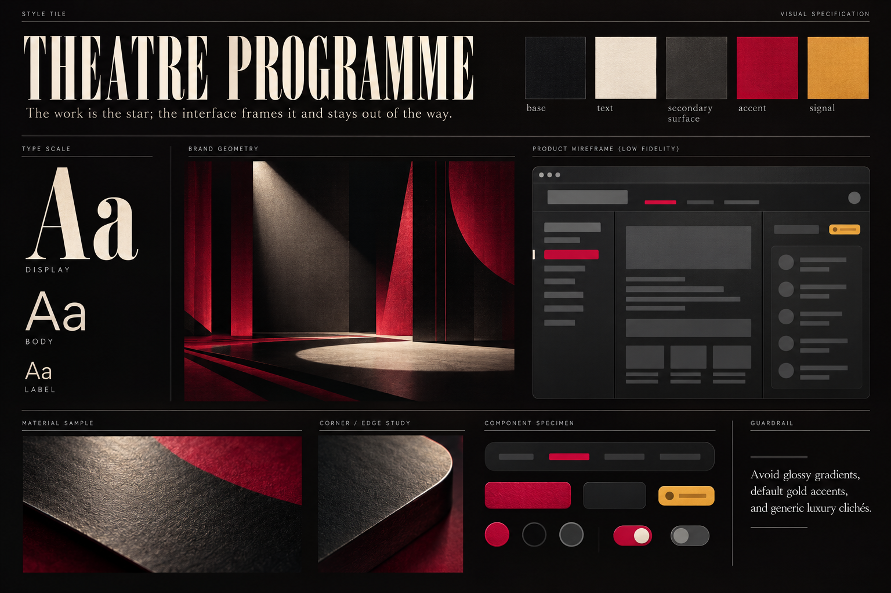

**P3 · Marquee 剧场场刊** — *Theatre programme.* Deep base with stage-light falloff, spotlight washes and long cast shadows; dramatic type-scale jumps carry the hierarchy.

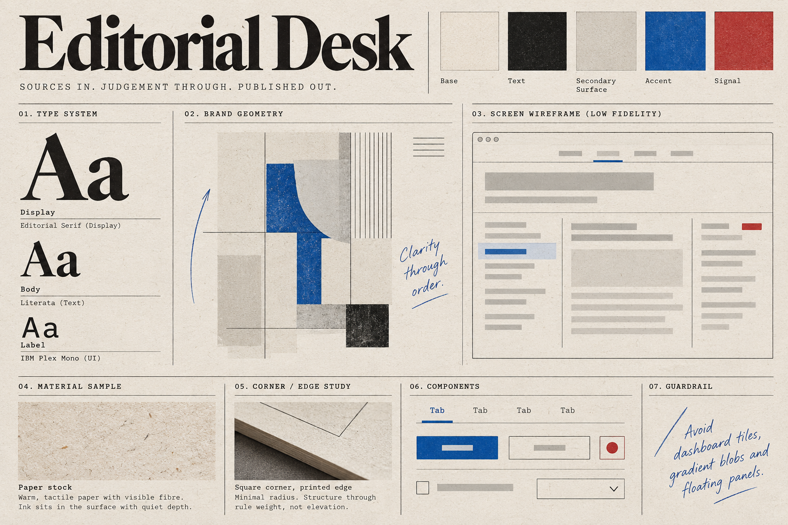

**P4 · Decision Desk 决策编辑台** — *Editorial desk.* Warm paper surface, hairline rules, marginalia in the margin. Hierarchy comes from reading order, not container count.

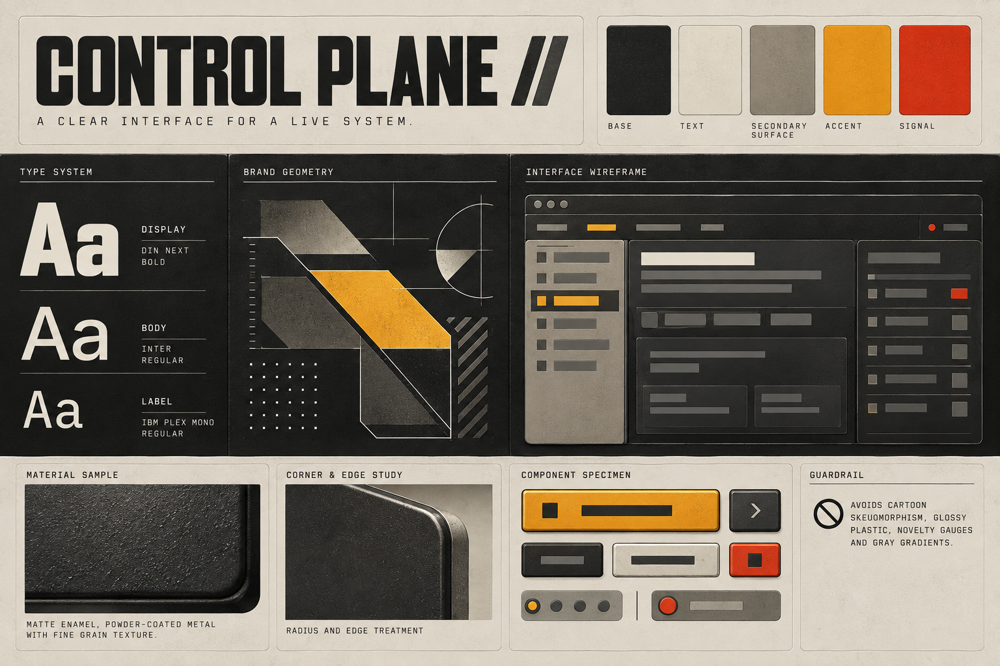

**P5 · Control Plane 运营控制平面** — *Industrial console.* Matte enamel grain, machined edges, etched markings. Density is legitimate when it maps to real machinery.

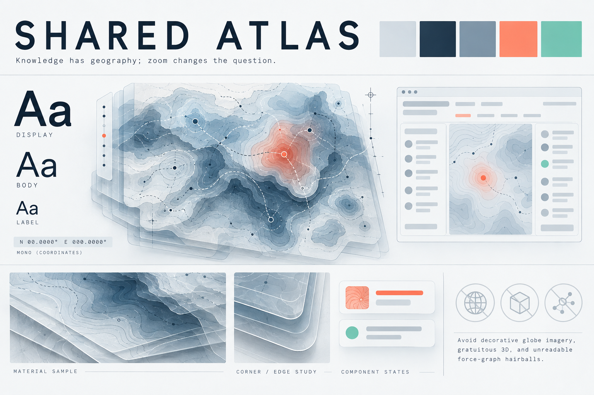

**P6 · Shared Atlas 共享数据地图** — *Cartography.* Genuinely translucent layered planes, contour rings, soft elevation shading. Relationship is the primary content.

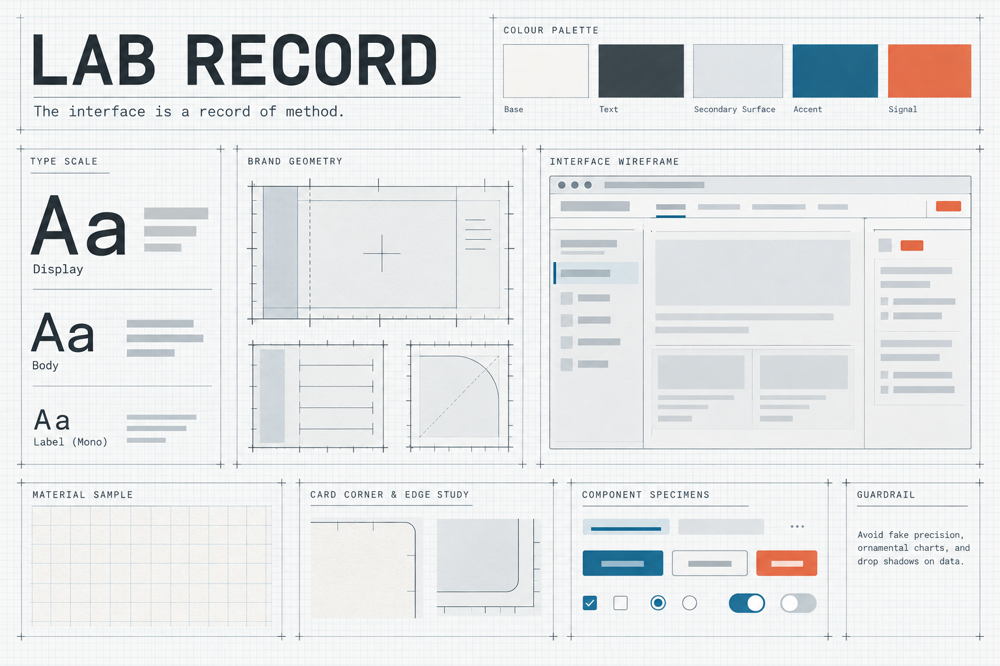

**P7 · Lab Bench 实验台** — *Laboratory record.* Graph paper as the substrate, ruled chart frames, precise tick marks. Every value shows its measurement.

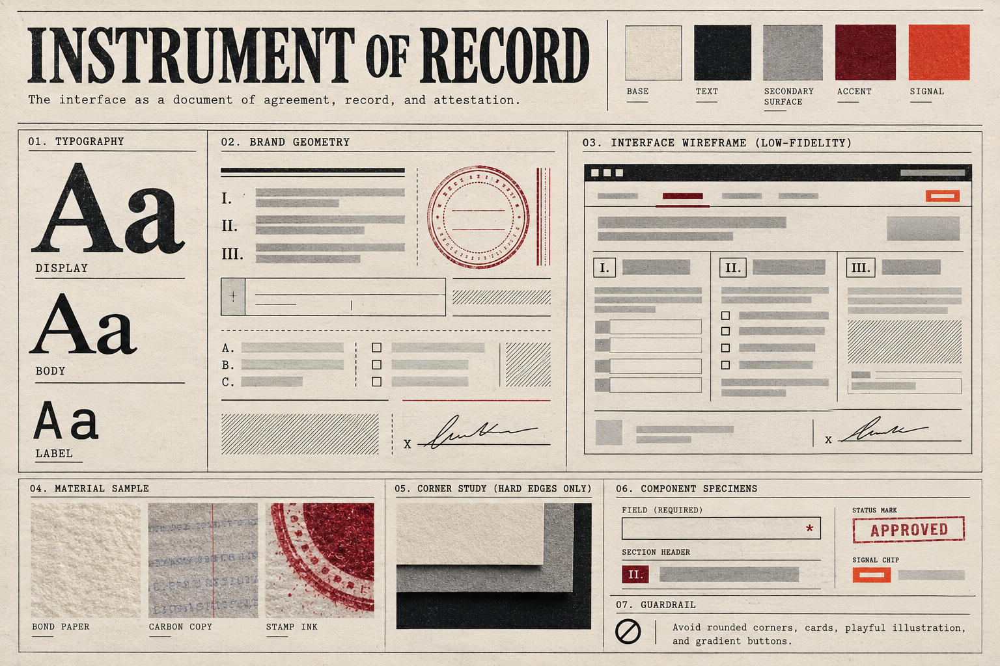

**P8 · Contract 合同/勘验单** — *Instrument of record.* Bond paper tooth, hard edges, zero rounding, one physical seal impression. Nothing floats outside the document.

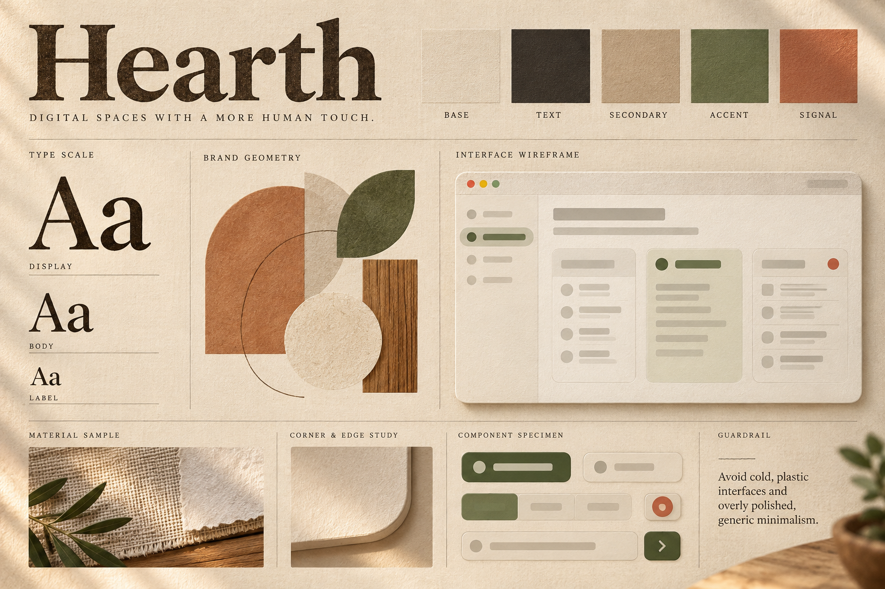

**P9 · Atelier 工坊** — *Warm human-scale craft.* Linen weave, soft diffused light, generously rounded panels. Warmth from proportion and material, not pastel haze.

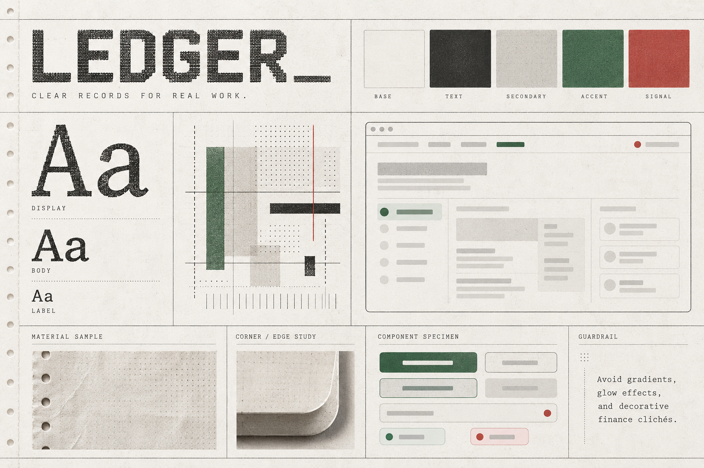

**P10 · Terminal Ledger 终端账本** — *Running record.* Thermal-print dot-matrix texture, ledger ruling, tabular figures, one green/red pair for signed meaning only.

> These boards are generated concept renders that illustrate each preset's direction. They are not production screenshots or evidence of guaranteed output quality.

## Repository structure

```text
ultra-ui-skill/
||-- SKILL.md                  Skill entrypoint and workflow router
||-- README.md                 English documentation
||-- README.zh-CN.md           Chinese documentation
||-- agents/openai.yaml        Codex UI metadata
||-- assets/showcase/          Mosaic concept renders
||   `-- presets/              Ten preset style boards
||-- references/               Style presets, creative direction, critic, and anti-AI guidance
||-- evals/                    Baseline, with-skill results, and a visual fixture
`-- LICENSE
```

## Install for Codex

PowerShell:

```powershell
$skillsRoot = if ($env:CODEX_HOME) { Join-Path $env:CODEX_HOME "skills" } else { Join-Path $HOME ".codex\skills" }
New-Item -ItemType Directory -Force -Path $skillsRoot | Out-Null
git clone https://github.com/leoliao19911017-stack/ultra-ui-skill.git (Join-Path $skillsRoot "ultra-ui-skill")
```

POSIX shell (optional):

```sh
skills_root="${CODEX_HOME:-$HOME/.codex}/skills"
mkdir -p "$skills_root"
git clone https://github.com/leoliao19911017-stack/ultra-ui-skill.git "$skills_root/ultra-ui-skill"
```

Both commands install to `~/.codex/skills/ultra-ui-skill` when `CODEX_HOME` is not set. Restart Codex or begin a new session if the skill is not discovered immediately.

## Use

Invoke it explicitly in a prompt:

```text
Use $ultra-ui-skill to turn this product brief into three genuinely different UI directions, recommend one, and define the observable design brief.
```

It may also be selected automatically when an interface risks feeling generic, template-driven, overdecorated, or recognizably AI-generated.

## Validate locally

PowerShell:

```powershell
$codexHome = if ($env:CODEX_HOME) { $env:CODEX_HOME } else { Join-Path $HOME '.codex' }
$validator = Join-Path $codexHome 'skills\.system\skill-creator\scripts\quick_validate.py'
$skill = Join-Path $codexHome 'skills\ultra-ui-skill'
python $validator $skill
```

POSIX shell:

```sh
codex_home="${CODEX_HOME:-$HOME/.codex}"
validator="$codex_home/skills/.system/skill-creator/scripts/quick_validate.py"
skill="$codex_home/skills/ultra-ui-skill"
python "$validator" "$skill"
```

The validator comes from Codex's locally installed `skill-creator` system skill. It checks skill packaging and frontmatter only; it does not prove design quality.

## Evidence and limits

The repository includes the [unassisted baseline](evals/baseline.md) and [with-skill evaluation](evals/with-skill.md). The recorded evaluations cover divergent direction exploration, subtraction before decoration, and a bounded screenshot critique. They are a small set of single-run behavioral observations, not proof of repeatable visual quality, production readiness, or superiority across models and projects.

## Source and independence

This is an independent distillation of publicly readable methods from [“How to turn your AI into a world-class designer”](https://www.lennysnewsletter.com/p/how-to-turn-your-ai-into-a-world), supplemented with clearly labeled production heuristics. It does not reproduce the article.

The public article is paywalled after the heading for Technique 7. This skill does not present unread paid material as sourced from the article.

Ultra UI Skill is not affiliated with, sponsored by, or endorsed by Lenny's Newsletter or Anshu Chimala.

## License

[MIT](LICENSE)
